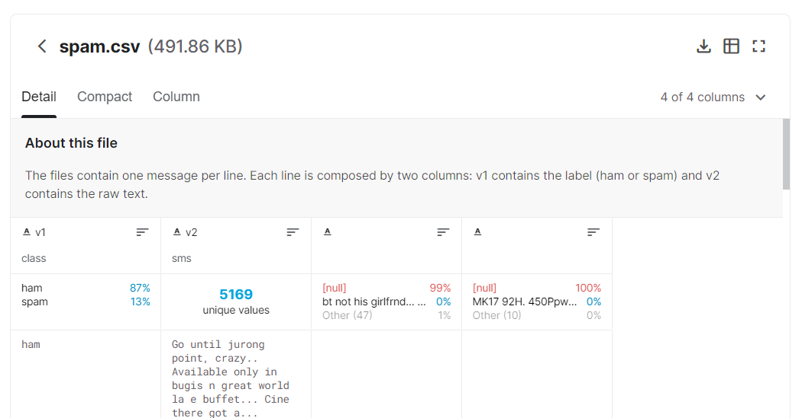

# LSTM-Spam-Detector
Spam Detector using RNN network for classification of spam and ham
---


## Software versions
---
Ubuntu 20.04 or precedent versions  
Python 3.8  
Tensorflow 2.3.0


## Run the project 
---

#### 1 Create a project folder

```
mkdir SpamDetector
cd SpamDetector
```

#### 2 Clone the project's repo

On the same SpamDetector folder 

```
git clone https://github.com/DanyOrtu97/LSTM-Spam-Detector.git
```

#### 3 Download the Dataset

Download "spam.csv" file from https://www.kaggle.com/uciml/sms-spam-collection-dataset by this button:




copy spam.csv into SpamDetector/LSTM-Spam-Detector/ directory


#### 4 Run the project

```
python3 SpamDetector.py
```
